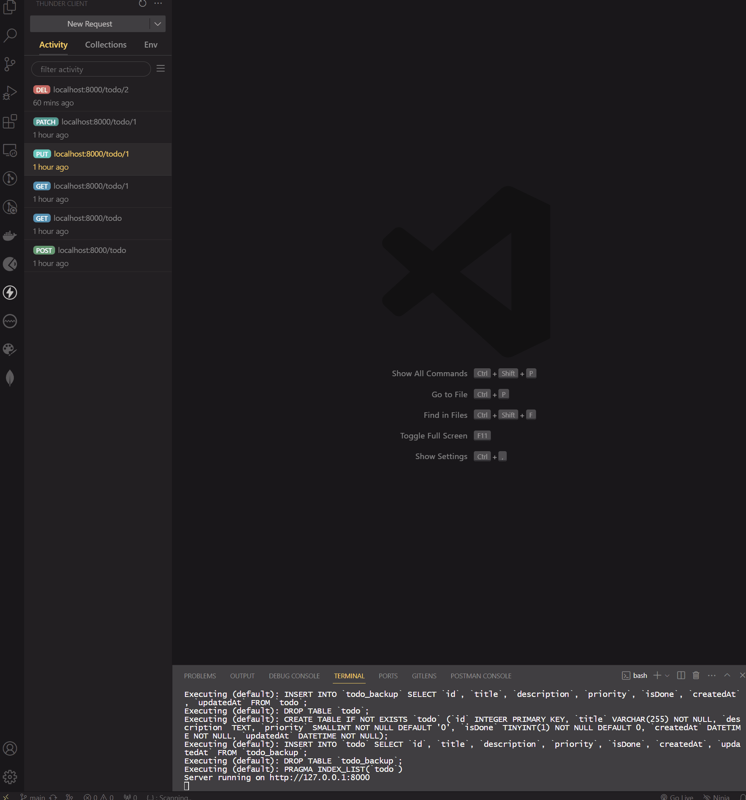

<div align=center>
	<h1>Todo Sequelize Express</h1>
</div>

<div align="center">
	<a href="https://plant-aluminum-raccoon.glitch.me/">
		
	</a>
</div>

<div align="center">
	<a href="https://glitch.com/edit/#!/plant-aluminum-raccoon/">
		
	</a>
</div>

<div align="center">
	
</div>

<hr>

## Description

A simple Todo API built with sequelize on sqlite engine.

## Goals

Practicing on NodeJS, ExpressJS, Sequelize.

## Technologies

- NodeJS
- ExpressJS
- Sequelize

## Installation

To run this app on your local, run commands below on the terminal:

1. Clone the repo on your local.

   ```bash
   git clone https://github.com/ehkarabas/nodejs-exercises.git
   ```

2. Install node modules to this sub-repo..

   ```bash
   yarn install
   ```

   or

   ```bash
   npm install
   ```

3. Run the app on your browser.

   ```bash
   yarn dev
   ```

   or

   ```bash
   npm run dev
   ```

## Resource Structure

```
todo_sequelize(folder)
|
├── README.md
├── app
│   ├── controllers
│   │   ├── errorHandler.js
│   │   ├── logEvents.js
│   │   └── todoController.js
│   ├── models
│   │   └── todoModel.js
│   └── routes
│       └── todoRouter.js
├── app.js
├── db.sqlite3
├── logs
│   └── reqLog.txt
├── package.json
└── presentation
    └── todo-sequelize-presentation.gif
```
