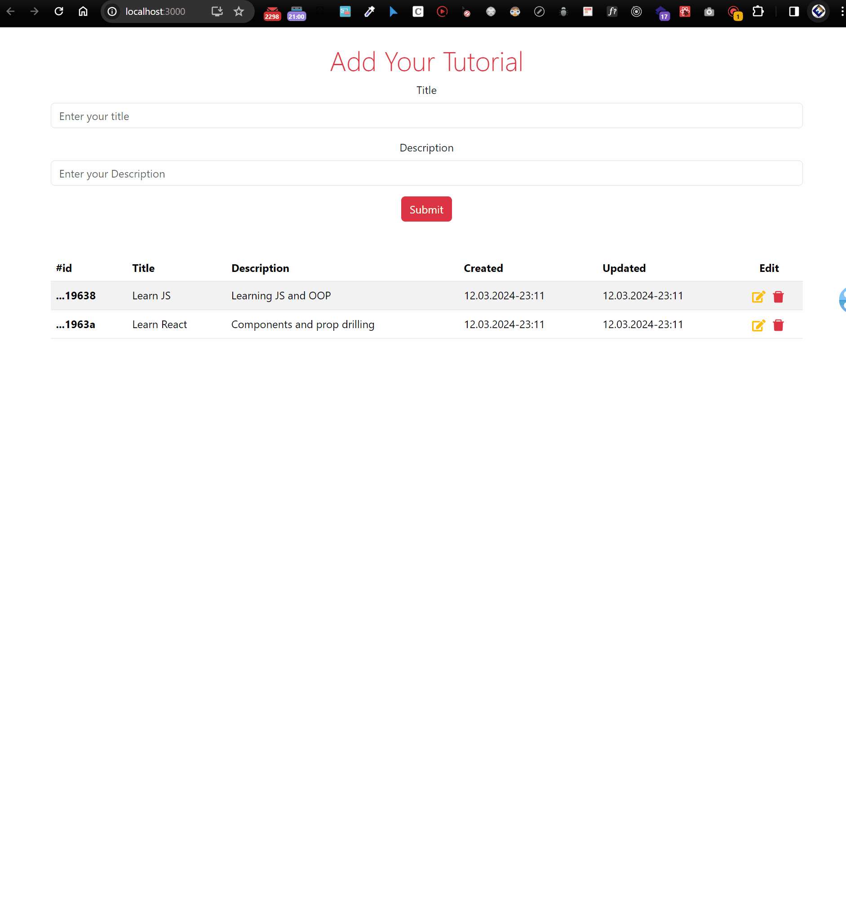

<div align=center>
	<h1>Tutorial App FS</h1>
</div>

<div align="center">
	<a href="https://tutorial-app-fe.vercel.app/">
		
	</a>
</div>

<div align="center">
  <p>Live API(<i>CORS protected</i>)</p>
	<a href="https://alluring-good-airship.glitch.me/">
		
	</a>
</div>

<div align="center">
	<a href="https://glitch.com/edit/#!/alluring-good-airship">
		
	</a>
</div>

<div align="center">
  
</div>

## Description

A simple tutorial tracking app of which frontend built with React & Bootstrap and backend built with Express & MongoDB & Mongoose.

## Backend Goals

Practicing on NodeJS, ExpressJS, MongoDB, MongooseJS, express middlewares & routing, custom middlewares(for error handling and id validation), modular route-controller-model structure, MongoDB configuration & connection to cloud, configuring cors to connect frontend to backend, mongooseJS schema & model API, transforming schema to make backend incompatible with frontend.

## Frontend Goals

Practicing on React, components, built-in hooks, prop drilling, Bootstrap.

## Technologies

- NodeJS
- ExpressJS
- MongoDB
- MongooseJS
- React
- Bootstrap

## Installation

To run this app on your local, run commands below on the terminal:

1. Clone the repo on your local.

   ```bash
   git clone https://github.com/ehkarabas/nodejs-exercises.git
   ```

2. Install node modules to this sub-repo..

   ```bash
   yarn install
   ```

   or

   ```bash
   npm install
   ```

3. Run the app on your browser.

   ```bash
   yarn dev
   ```

   or

   ```bash
   npm run dev
   ```

## Resource Structure

```
tutorial_app_fs(folder)
|
├── README.md
├── backend
│   ├── configs
│   │   └── dbConnection.js
│   ├── controllers
│   │   └── todoController.js
│   ├── errors
│   │   └── customError.js
│   ├── index.js
│   ├── middlewares
│   │   ├── errorHandler.js
│   │   └── idValidation.js
│   ├── models
│   │   └── todoModel.js
│   ├── package.json
│   └── routes
│       └── todoRoute.js
├── frontend
│   ├── package.json
│   ├── public
│   │   ├── favicon.ico
│   │   ├── index.html
│   │   ├── logo192.png
│   │   ├── logo512.png
│   │   ├── manifest.json
│   │   └── robots.txt
│   └── src
│       ├── App.js
│       ├── components
│       │   ├── AddTutorial.jsx
│       │   ├── EditTutorial.jsx
│       │   └── TutorialList.jsx
│       ├── index.js
│       └── pages
│           └── Home.jsx
└── presentation
    └── tutorial-app-fs-presentation.gif
```
